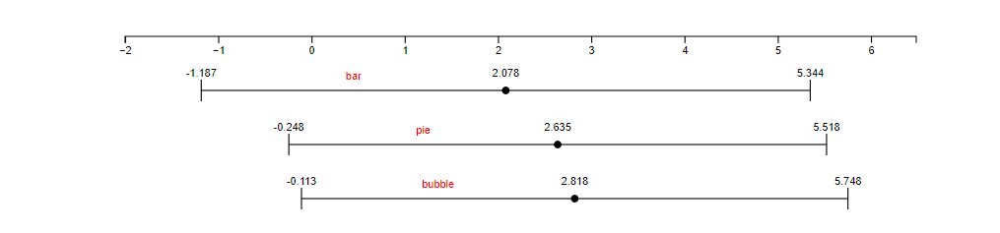
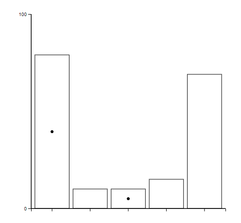
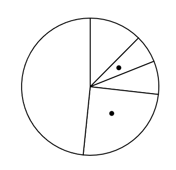
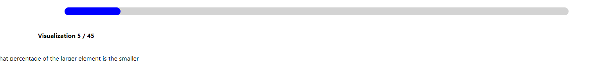
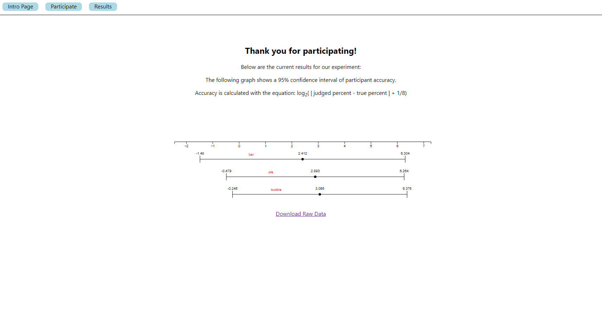

**Experiment Link: https://bhnord.github.io/a3-Experiment/**

# Assignment 3 - Replicating a Classic Experiment

1. For our experiment, we sought to compare users' ability to differentiate the sizes of points when viewing **Bar Charts**, **Pie Charts**, and **Bubble Charts**. We developed an application in React to host the experiment and display the results after each assessment. We had 16 people participate in the experiment for a total of 240 trials for each type of visualization.

# Results

# First Place Chart Type

Our best performing chart type was the bar chart.

## Calculated Error (Bar)

For this chart type, we calculated a log2Error of 2.078 across all trials
 
The results can be seen below under the "bar" label

# Second Place Chart Type

Our second best performing chart type was the pie chart.
 

## Calculated Error (Pie)

For this chart type, we calculated a log2Error of 2.635 across all trials
 
The results can be seen below under the "pie" label

# Third Place Chart Type

Our third best performing chart type was the bubble chart.

When constructing a bubble chart, it is essential to adhere to the principle of displaying bubble scale in a gradual increment to optimize human perception.

This ensures that viewers can accurately perceive and interpret the scale. Depending on your chart creation method, you might need to scale your data to align with how values are translated into point sizes. Some visualization tools automatically correlate values with areas, but caution is warranted when dealing with cases where values correspond to diameter or radius.

## Calculated Error (Bubble)

For this chart type, we calculated a log2Error of 2.818 across all trials
 
The results can be seen below under the "bubble" label

# Technical Achievements

## Creating a React App

- We created and hosted our own React application with multiple pages and routing functionality.
- We implemented an: [Intro Page](https://bhnord.github.io/a3-Experiment/), [Particpate Page](https://bhnord.github.io/a3-Experiment/#/test), and a [Results](https://bhnord.github.io/a3-Experiment/#/results) page.

## Implementing Firebase

- For this assignment we store each participant's responses in a firebase firestore database.
- We also use this database to show participants our overall results on the "results" page.

## Dynamically Generating CSV

- We use firebase as well to generate a CSV file downloadable on our website that
  reflects the most recent data that has been submitted in our experiment, shown on our [results page](https://bhnord.github.io/a3-Experiment/#/results)

## Dynamically Generating Results

- We [dynamically generate our results chart](https://bhnord.github.io/a3-Experiment/#/results) based on the firebase database, and the collection
  of user data. This means that whenever a new user completes the questions in the experiment, the
  results page will reflect this new data automatically.

# Design Achievements

## Progress Bar for Experiment

- We generated a progress bar that would let the user know how far into the assessment they were, and how much was left.

## Results Display

- We [created a display](https://bhnord.github.io/a3-Experiment/#/results) for the results that the user could see, to increase engagement with the experiment.
   
  

## Simple and Understandable React Layout

- We utilized React to create an app that was simple and appealing to view.

## Introduction Page

- We included an [introduction page](https://bhnord.github.io/a3-Experiment/) with instructions for completing the experiment to make it clear to the users how the app works.

