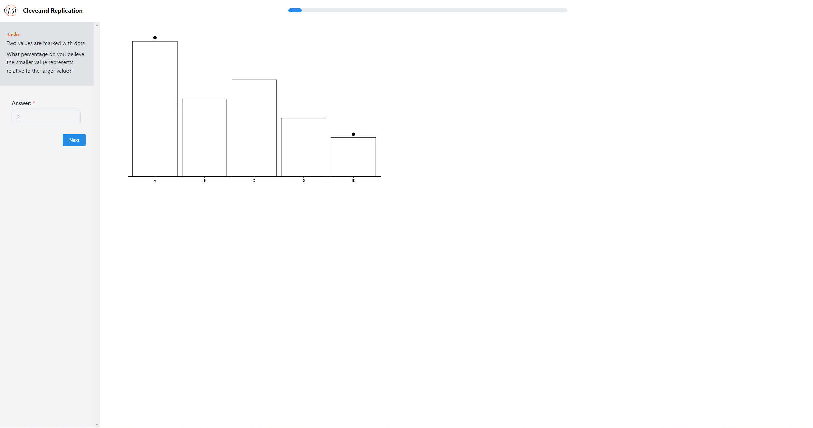
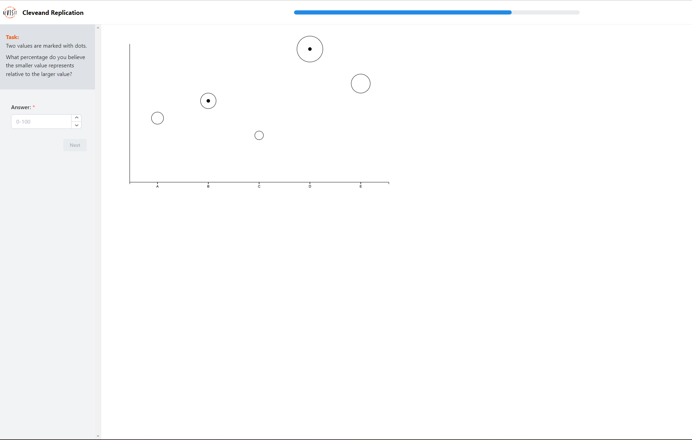
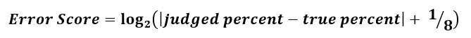

# Assignment 3 - Replicating a Classic Experiment

## Team Insight Explorers

by: Andrew Kerekon, Aviv Nur, Bijesh Shrestha, Yihan Wang

## Link to our study page

Link: https://bijeshshrestha.github.io/revisit/

## Link to our study repository 

Link: https://github.com/BijeshShrestha/revisit

# About our study

## Original study:
In the original study by Cleveland and McGill [1], subjects were asked to judge various charts that focused on several perceptual tasks. Their findings included the rankings of elementary perceptual tasks by accuracy. The rankings published are position along a common scale, position along non-aligned scales, length, direction, angle, area, volume, curvature, and shading/ color saturation. In our study, we replicate parts of the original study with some additional stimuli to test and compare the findings of the original study along with some additional hypotheses of our own.  

## Our study's research questions and Hypothesis:

### Perceptual task for analysis (Research Questions)
- **Common Scale:** How will participants view charts where data elements share a common axis, allowing for direct positional comparisons?
- **Non-aligned Scale:** How will participants view charts where elements are sized based on value but lack a common axis for direct positional comparisons?
- **Behavior for rounding and scaling:** How will participants round answers, and use values ending in multiple of 5's and 10's?

### Hypothesis

- **H1:** Participants will be more accurate in comparing individual values within bar charts compared to stacked bar charts, bubble charts, and pack circle charts.
- **H2:** Participants will exhibit greater accuracy in determining overall proportions or trends within a stacked bar chart compared to bubble charts or packed circle charts.
- **H3:** Participants will demonstrate the lowest accuracy when making comparisons or estimations using bubble charts compared to all other chart types
- **H4:** Participants will be more likely to round estimations to multiples of 5 and 10, regardless of chart type.

## Study Protocol

### Modifications and Experimental Design

We grounded our modifications and refinements of the original Cleveland and McGill experiments [1] in their established principles of visual perception. To investigate the impact of perceptual task differences on visualization interpretation, we conducted a controlled experiment featuring four chart types: bar charts, stacked bar charts, bubble charts, and pack circles. This selection allows for within-group comparisons, as bar and stacked bar charts share greater similarity, as do bubble and pack circle charts.

### Procedure and Data Collection

Twenty participants completed 200 trials per chart type. Participant responses were recorded, scored, and compiled into a master CSV file for subsequent analysis. To evaluate performance across chart types, we employed Cleveland-McGill error scores, providing a standardized metric for comparison.

  - Introduce participants to our study
  - Ask participants to sit in front of a computer with the reVISit platform loaded and order of d3 visualizations randomized
  - Answer any questions they may have about study procedure and the proper format to answer questions
  - Obtain their consent to participate
- Observe participants as they completed the study, to ensure a controlled environment
## Visualization types used

We used D3 for editing and we chose four different charts.

**Bar chart:** A bar chart is a commonly used data visualization tool for displaying and comparing quantitative     relationships between different categories. It is intuitive, easy to read, and flexible.

**Stacked bar:** Stacked bar charts are a variation of bar charts in which each bar is divided into segments that represent the values of different subcategories, while the length of the entire bar represents the sum. The benefits of stacked bar charts include showing overall trends versus details, comparing components, and more.

**Bubble chart:** A bubble chart is a type of chart used to present three-dimensional data where each bubble represents a data point. The benefits of bubble charts include multi-dimensional presentation, visualization, and more.

**Pack circle:** Circle packed diagrams are a visualization method for displaying hierarchical data, where each circle represents an element in the dataset, the size of the circle is usually proportional to some numerical quantity, and the nested structure of the circles demonstrates the hierarchical relationship of the data. The benefits of circle packing diagrams include intuitive display of hierarchical structure excellent use of space, and so on.

## Platform for experiment

**IDE:** We used Visual Studio Code for the development of our experiment based on the reVISit repository [2].

**Experiment and Hosting Platform:** The reVISit framework empowers researchers to design and deploy interactive, web-based visualization studies. At its core lies a declarative Domain Specific Language (DSL) termed reVISit.spec, expressed in JSON format. This DSL provides a structured means to define study parameters, incorporating stimuli such as images, interactive HTML pages, and response components tailored for visualization research [2]. 

URL to our GIT for revisit clone: https://github.com/BijeshShrestha/revisit.git

## Experiment design and user interface 

For our experiment, we used both visual and verbal guidance to guide and orient participants to ensure clear understanding for valid data collection. The deployed study can be found at https://bijeshshrestha.github.io/revisit/. We used 10 questions for each chart type, for a total of 40 questions. A total of 20 participants were enrolled in the trial.

After entering the page, you can see the introduction of our study, click next to carry out our study!

This page is an introduction to what we are learning about the percentage of smaller graphs to larger ones. Click NEXT to start our experiment!

This page shows four different graphs where the percentage of the graphs with black dots is calculated between the can fill in the answer on the left as you see fit.

This screen appears after all surveys have been completed!

After conducting the survey, the collected data was organized and analyzed, and the data results were visualized in Jupyter notebook (attached).

## Data Collection and Cleaning for Analysis

We collected data using the following process:
- Download a CSV file after each participant containing their answers compared to the correct response
Once data was collected from all 20 participants, we cleaned and analyzed data as follows:
- Remove outlier test values that appeared to be input errors by participants
- Cleaned data using Excel and pandas to compare only correct values against test values
- Created visualizations using numpy and matplotlib in Python 

## Data Analysis Method

Following necessary data cleaning procedures, we employ either a log-base-2 transformation or the cm-error metric to quantify the accuracy of participants' perceptual judgments. This approach aligns with the methodology established in the original Cleveland and McGill paper [1], utilizing the following equation:

This metric will facilitate a rigorous comparison of performance across the tested chart types. Lower error scores will signify superior performance.  To enhance the robustness of our analysis, error bars will represent bootstrapped 95% confidence intervals. Finally, we will compare our average error scores to the benchmark results reported by Cleveland and McGill.

# Results and Analysis
## By chart type

is chart compares the accuracy of different chart types (bar charts, pack circles, stacked bar charts, and bubble charts). Each chart type is represented by its average log error rate (indicated by a dot) and a confidence interval (shown by the horizontal line). The bar chart demonstrates the smallest margin of error, suggesting it is the most accurate and consistent chart type in this case. Conversely, the packed circle chart exhibits the largest margin of error.

**Figure 1.** Accuracy by Chart Type with Bootstrapped 95% CI

**Table 1.** Accuracy Scores by Chart Type with Bootstrapped 95% CI

## By participants

This chart evaluates the accuracy of participant responses within our study. Bootstrapped confidence intervals illustrate the variability inherent in the accuracy measurements. Each point represents an individual participant, with the horizontal line denoting the margin of error associated with their response. The x-axis employs a logarithmic error scale for data representation.

**Figure 2.** Accuracy by Participants with Bootstrapped 95% CI

**Table 2.** Accuracy by Participants with Bootstrapped 95% CI

## By answer pattern

This bar graph illustrates the distribution of participant response tendencies regarding terminal digits (0, 5, or neither).  Results indicate that approximately 60% of participants frequently provide answers ending in 0, while nearly 30% favor answers ending in 5.

**Figure 3.** Participant's tendency to answer with 0, 5, or neither

This chart compares proportions of true values that are associated with numbers ending in 0, 5, or neither. Most of the true values or almost 70% are neither 0 nor 5.

**Figure 4.** Participant's tendency to answer with 0, 5, or neither compared with true values

# Lessons learned and feedback from participants

- Participants mentioned that the bar chart and stacked bar were easier to estimate for the given tasks compared to bubble and pack circles. 
- Participants mentioned that the use of circular dot for bubble chart and pack circle caused distraction while estimating areas for comparison.
- Participants would like to have their individual results presented to them at the end of the study session.  

## Technical achievements
  - Forked reVISit repository and connected to our own Google Cloud Firebase instance to ensure deployment to GitHub Pages was possible
  - Developed scalable d3 visualizations that future experiments may use or modify
  - Using reVISit, all visualizations can be customized both in size and in which indices are compared, so an arbitrary number of visuals can be displayed. Future experiments may include more than 5 visuals for “noise” to study if this impacts comparison accuracy
- Analyzed data using Python libraries such as numpy and matplotlib in a Jupyter Notebook

## Design achievements

- Developed four different d3 visualizations (bar chart, stacked bar chart, bubble chart, pack circle) that are simple and scalable for future experiments. The style of these visualizations mimic those of Cleveland and McGill’s original experiment [3].
- Matplotlib visualizations are color-coded and scaled for easy comparison on correct outputs vs. test outputs.

# References

[1] [Cleveland WS, McGill R. Graphical perception: Theory, experimentation, and application to the development of graphical methods. Journal of the American statistical association. 1984 Sep 1;79(387):531-54.]

[2] https://revisit.dev/

[3] https://d3js.org/ 
