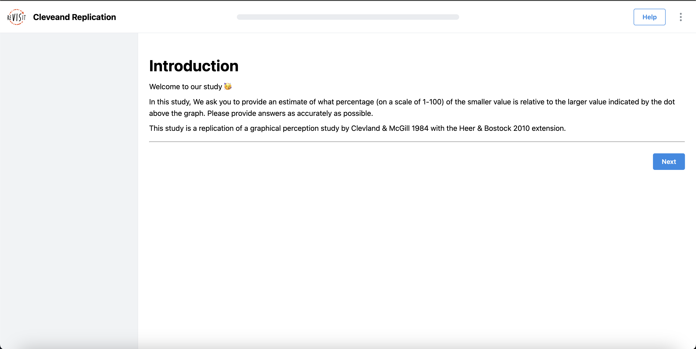
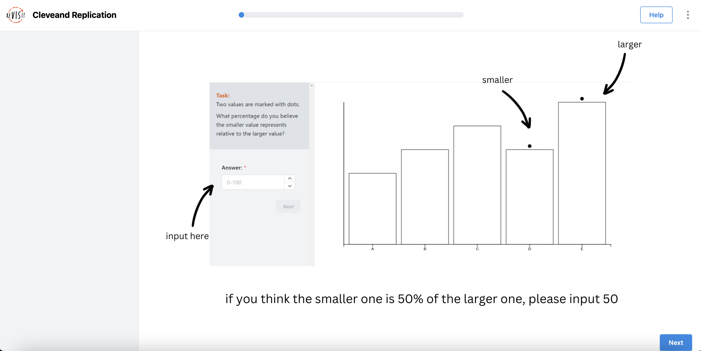
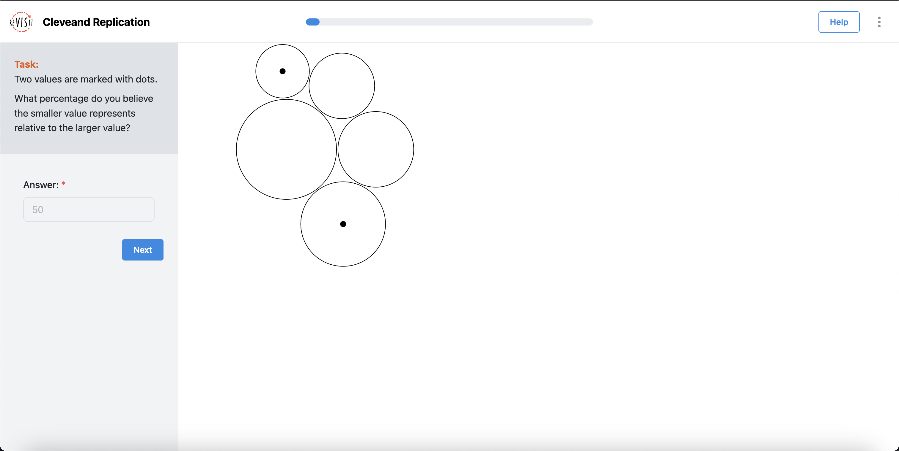
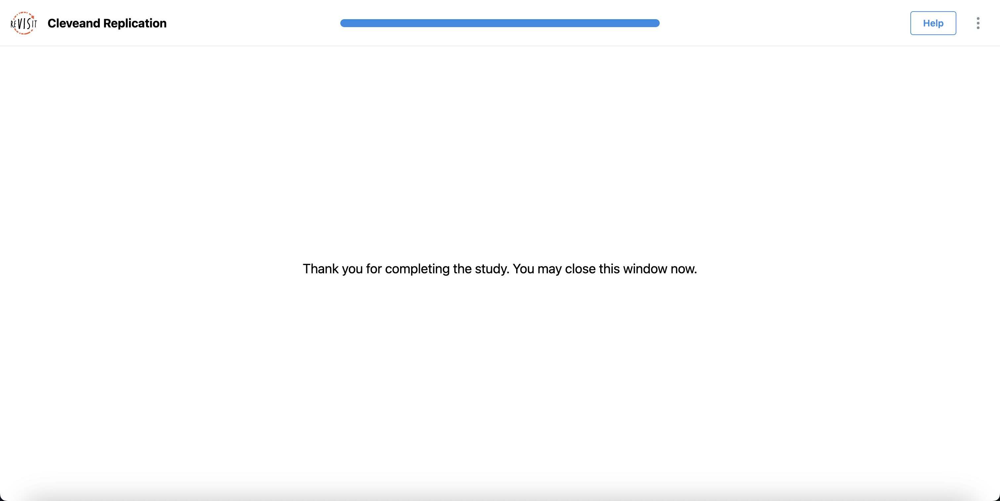
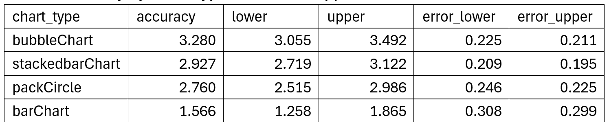
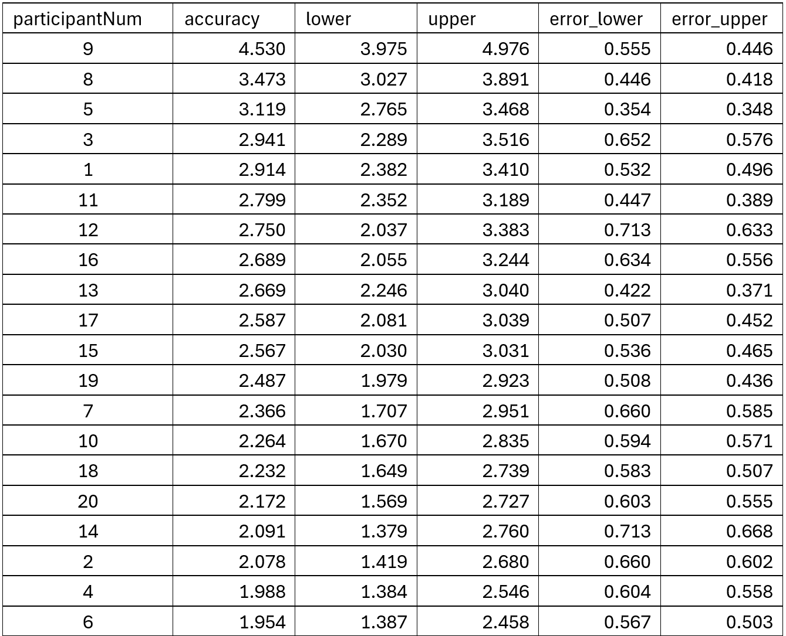
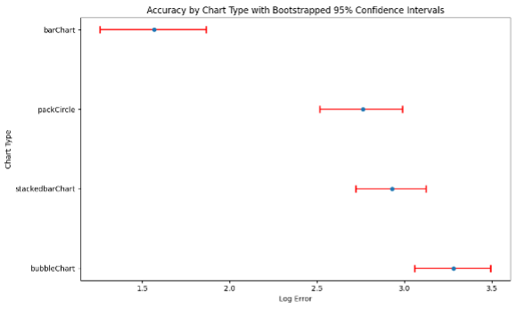
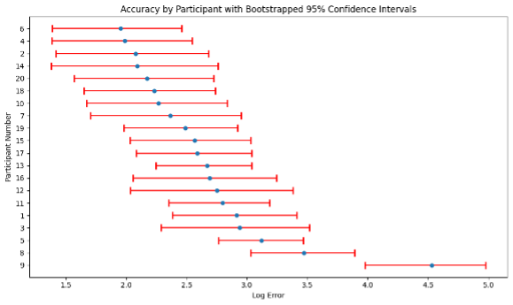
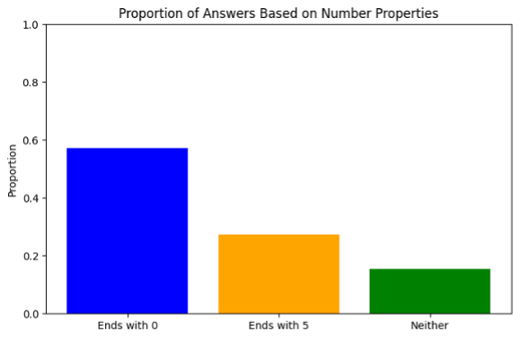
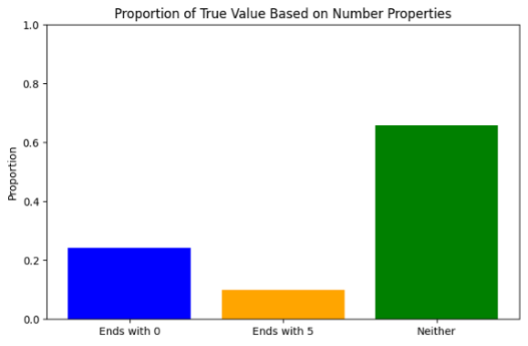

# Assignment 3 - Replicating a Classic Experiment

by: Andrew Kerekon, Aviv Nur, Bijesh Shrestha, Yihan Wang

Link to the survey: https://bijeshshrestha.github.io/revisit/

# About our study

In the original study [1], subjects were asked to judge bar graphs and pie charts. In the first experiment, subjects made five judgments, two were length judgments and three were position judgments on a common scale. Subjects had to visually assess the percentage of a value to a larger value. All values recorded were between 0 and 100. There were 51 subjects with available data. In the second experiment, subjects made two judgments, position and angle.

We based our modifications and refinements on the original experiments. In order to compare different visualizations, we conducted a controlled experiment using four charts, namely bar chart, stacked bar, bubble chart, and packed circle. Since the first two are more similar and the last two are more similar, this allows us to see how the experimenters perform in similar charts. And their responses or interpretations of these visualizations were recorded and analyzed. We conducted the experiment with 20 participants and with 200 trials for each chart. Participants' responses will be scored and stored after each trial, and the data will then be compiled into a master CSV file for analysis. Error measurement is an important part of this process, and Cleveland-McGill error scores are used to compare the performance of the test charts.

# Visualization types used

We used D3 for editing and we chose four different charts.

Bar chart: A bar chart is a commonly used data visualization tool for displaying and comparing quantitative     relationships between different categories. It is intuitive, easy to read, and flexible.

Stacked bar: Stacked bar charts are a variation of bar charts in which each bar is divided into segments that represent the values of different subcategories, while the length of the entire bar represents the sum. The benefits of stacked bar charts include showing overall trends versus details, comparing components, and more.

Bubble chart: A bubble chart is a type of chart used to present three-dimensional data where each bubble represents a data point. The benefits of bubble charts include multi-dimensional presentation, visualization, and more.

Pack circle: Circle packed diagrams are a visualization method for displaying hierarchical data, where each circle represents an element in the dataset, the size of the circle is usually proportional to some numerical quantity, and the nested structure of the circles demonstrates the hierarchical relationship of the data. The benefits of circle packing diagrams include intuitive display of hierarchical structure excellent use of space, and so on.

# Platform used

We used Visual Studio Code to write the four diagrams and later connected the diagrams to the Revisit [2] platform for our study and testing.

reVISit allows you to create interactive, web-based study setups using a JSON Domain Specific Language (DSL), called reVISit.spec, and a set of stimuli specified in the DSL. After creating the specification and stimuli, you can build your study and deploy it to the Web. You can use stimuli such as images, (interactive) html pages, or response components.

The ReVISit framework uses declarative DSL (Domain Specific Language) to specify visualization experiments. Configuration files are compiled into the ReVISit platform using JSON format.The ReVISit framework provides an environment that allows researchers to build web-based visual user studies by cloning/forking github repositories. Users can then customize the properties of the configuration file to specify the desired study components (consent, training, practice, trial, stimulus, and survey).

URL to our GIT for revisit clone: https://github.com/BijeshShrestha/Revisit.git

# Study Protocol

We use D3 objects for the creation of four different graphs, bar chart, stacked bar chart, bubble chart and packed circle chart, where the first two are similar and the last two are similar, making it easier to compare and analyze the data at a later stage. We connect the four charts to revisit developments.

We used 5 questions for each chart, for a total of 20 questions. A total of 20 participants were enrolled in the trial.

After entering the page, you can see the introduction of our study, click next to carry out our study!

This page is an introduction to what we are learning about the percentage of smaller graphs to larger ones. Click NEXT to start our experiment!

This page shows four different graphs where the percentage of the graphs with black dots is calculated between the can fill in the answer on the left as you see fit.

This screen appears after all surveys have been completed!

After conducting the survey, the collected data was organized and analyzed, and the data results were visualized in Jupyter.

# Analysis result

Table 1. Accuracy by Chart Type with Bootstrapped 95% CI

Table 2. Accuracy by Participants with Bootstrapped 95% CI

This chart is assessing the accuracy of participants (possibly in a study or test) and uses Bootstrapped confidence intervals to show the variability or certainty of the accuracy measure. Each point represents a participant, the horizontal line indicates the margin of error in their response, and the x-axis has a logarithmic error scale.

This chart compares the accuracy of different types of charts (bar charts, packed circle charts, stacked bar charts, and bubble charts). Each type of chart has an associated average log error rate (indicated by the dots on the chart) as well as a confidence interval shown by the horizontal line. The bar chart type shows the smallest margin of error, indicating that it is likely to be the most accurate or consistent in this case, while the packed circle shows the largest margin of error.

This bar graph shows the percentage of values that are considered "true" depending on whether they end in 0, 5, or neither. The green bar labeled "Neither" indicates a higher percentage of true values compared to numbers ending in 0 or 5.

This chart compares proportions, but it is not clear if it is the same "true" value that is being discussed or if it refers to responses in a survey or study. It seems to indicate that a higher percentage of responses are associated with numbers ending in 0, a lower percentage of responses are associated with numbers ending in 5, and the fewest responses are associated with numbers ending in 0.

# Data Collection and Cleaning for Analysis

We used the Revisit platform for data collection in our D3.js experiments, where we collected data while the participants conducted their trials. We collected all data by downloading a csv file of the relevant data after the participants completed the experiment. The experiments were conducted in a controlled environment where participants' participation could be closely monitored. During the data cleaning process, we meticulously removed any test values that could have biased the results. We also took care to confirm that the correct values were accurately recorded, thus creating a reliable dataset with which to compare test values. This rigorous approach ensured the integrity and validity of the data for our subsequent analysis.

We use pandas to clean the data and we use a variety of libraries such as matplotlib and numpy.

# Lessons learned and Feedback from Participants

More than half of the participants found the bar chart and stacked bar easier to see the percentage, while the bubble and packed circle had some difficulty seeing the size of the percentage.

# References

[1] Cleveland WS, McGill R. Graphical perception: Theory, experimentation, and application to the development of graphical methods. Journal of the American statistical association. 1984 Sep 1;79(387):531-54.
[2] https://revisit.dev/
