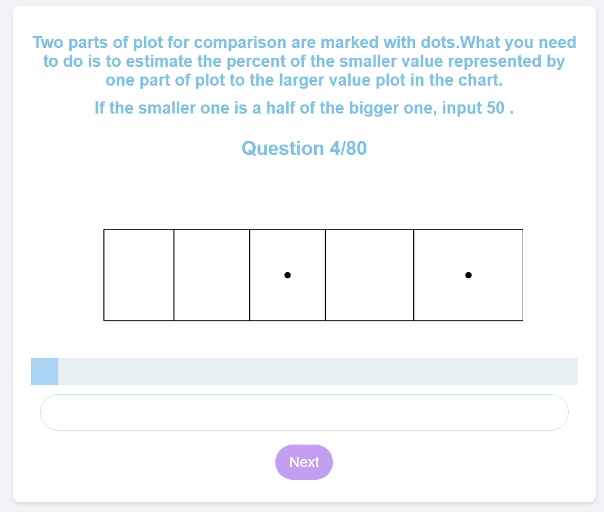
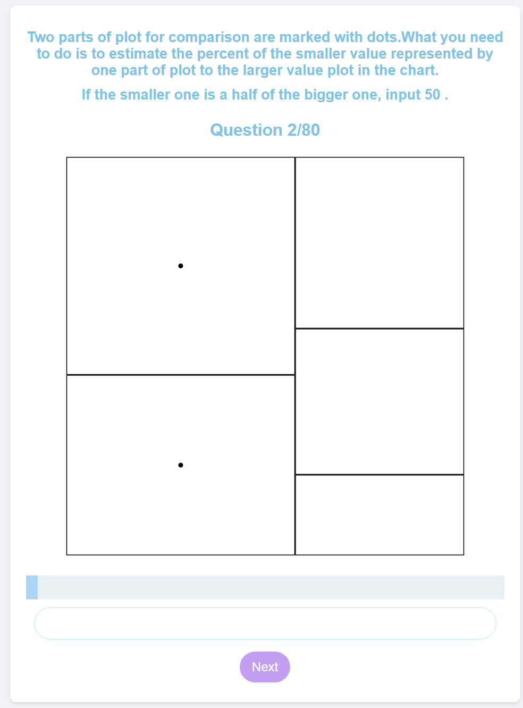
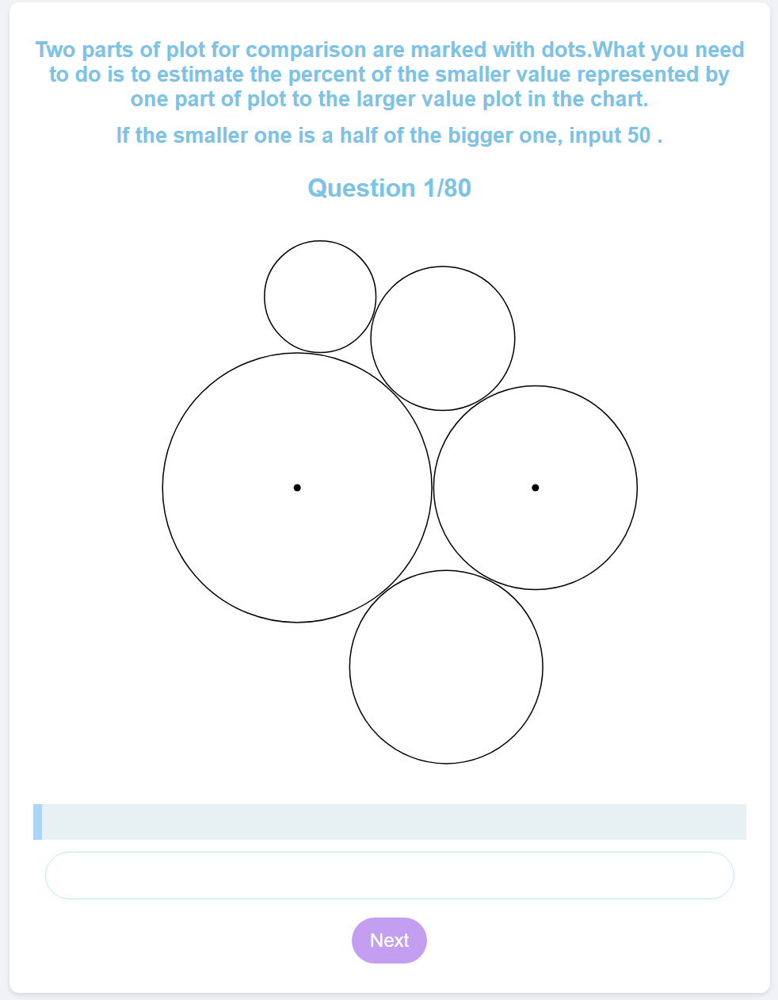

Assignment 3 - Replicating a Classic Experiment  
===
## Jazz Group Members：
**Dong Tang, Anthony Chen, Songling Li, Jinqin Xiong**

## Page Link:
link: https://dongtang3.github.io/a3-Experiment/

## Our Repository Link
link: https://github.com/dongtang3/a3-Experiment

# 1️⃣ Our Study 
## Introduction:
According to Cleveland and McGill [1], our project offers an exciting opportunity to delve into the world of scientific experimentation and data visualization. By replicating classic experiments and applying modern methodologies, you'll gain valuable insights into the effectiveness of different visualization techniques. Get ready to shine as a data scientist and uncover fascinating findings that contribute to the field of data visualization! In this endeavor, we embark on a journey to replicate a classic experiment, echoing the pioneering works of luminaries such as Cleveland and McGill, and building upon modern methodologies championed by Heer and Bostock. 

## Survey
- In this assignment, we lay the groundwork for a controlled experiment that seeks to answer pressing questions about visualization techniques. Drawing inspiration from seminal works and contemporary research, we design an experiment that stands as a testament to the scientific method's power. 
- Every single graph generated is unique, made by a random number generator for data point having a value ranging from 1-100 and generating between 5-10 data points each, in each graph 2 bars are made black dot to indicate that they are the ones to compare. 
- Additionally there are 4 different types of bar graphs used in the experiment, Vertical Bar Chart, Upside Down Bar Chart, Bar Chart Facing Right, and Bar Chart Facing Left. The choice between which chart to display is random, however, they are all limited to 20 attempts each per survey allowing for a total of 80 datapoints. 
- Additionally, the data is collected through a button where if pressed a prompt will appear asking for how big the smaller marked bar is compared to the smaller one in a percentage (i.e. 100% = 100). After all 80 graphs are marked a CSV will download where every each column is a type of graph and the data in the columns is the log2(error) of the data.

 

## Charts for Data Visualization 
  In our study, we examined the efficacy of different visualization techniques in helping users discern point sizes. Our application, developed using React, allowed participants to interact with the visualizations and provided immediate feedback after each task. With 16 individuals partaking, we amassed 240 evaluations per visualization across four distinct chart types, rendered using D3.js. 

  We selected the following four visualizations for our experiment:

**1.  Stacked Charts**: These are enhanced bar charts where each bar is subdivided into smaller segments that represent different subcategories. The collective height of these segments illustrates the total value. Stacked charts are particularly useful for observing overall trends and comparing the make-up of different categories. 

 

**2.  Donut Charts**: A variant of pie charts, these display data in a ring shape, allowing for a visually appealing comparison of parts to a whole. They are effective for showing categorical data and providing a quick snapshot of the proportionate distribution. 

 

**3.  Tree Map**: Tree maps are used for displaying hierarchical data via nested rectangles, with each rectangle's size and color representing a particular dimension of the data set. They are efficient in space utilization and effective for showing attributes of data such as size and category. 

 

**4.  Bubble Charts**: These charts present multi-dimensional data, with each bubble representing a data point and the size and position of the bubble corresponding to data values. Bubble charts are excellent for visualizing complex data sets where each bubble can encapsulate multiple data dimensions. 

 

  Each visualization technique was chosen for its unique strengths in representing data and assisting viewers in understanding complex information patterns.

   

# 2️⃣ Data Collection and Clean
## Data Collection Process
  We gathered data through the following steps:
- Downloaded a CSV file for each participant, containing their responses compared to the correct answers.
- After data collection from all 20 participants, we proceeded with data cleaning and analysis.

## Data Cleaning and Analysis
  **Data cleaning involved:**
- Removing outlier test values, which seemed to be input errors by participants.
- Utilizing Excel and pandas to compare correct values against test values.
- Visualizations were created using numpy and matplotlib in Python.
 

# 3️⃣ User Interface Design
## **Start Page:**

## **On_Going Page：**

## **End Page:**

 

# 4️⃣ Data Analysis Method:
## **Error Function:**
   
    **After necessary data cleaning:**
- We employed either a log-base-2 transformation or the cm-error metric to quantify participants' accuracy in perceptual judgments.
- This methodology aligns with the approach established in the original Cleveland and McGill paper [1]. 
  **Error Score Calculation:**
- A metric was derived to enable a rigorous comparison of performance across different chart types.
- Lower error scores indicate superior performance. 
  **Robustness Enhancement:**
- Error bars were incorporated to represent bootstrapped 95% confidence intervals. 
  **Benchmark Comparison:**
- Average error scores were compared with benchmark results reported by Cleveland and McGill.
 

# 5️⃣ Experiment Result and Analysis
## **Our Result**:

## **Cleveland Result**:

 

## **Analysis:**
  **Why do the error bars look very similar across different **'Vis Type'** categories?**

  The graph shows point estimates of the 'accuracy_error_shifted' for different 'Vis Type' categories with error bars representing 95% confidence intervals. These intervals are calculated based on bootstrapping, which is a method for statistical inference. 

  If the data across these groups are similar in terms of their 'accuracy_error' values. That could cause this phenomenon. 

  ## **Additional Analysis Graph:**
  

  **Here's our additional analysis:**
- We plotted each trial as a dot to see what's underneath the hood.

- Based on the output graph showing the individual data points. We can see:

1.  **Variance within Groups:**  Each chart type seems to have a wide range of logarithmic errors among its individual data points. This suggests there is considerable variance within each chart type category.

2.  **Overlap of Confidence Intervals:**  The confidence intervals for different chart types overlap considerably. This implies there might not be a statistically significant difference between the average errors of the chart types.

3.  **Error Distribution:**  Some chart types show a more concentrated cluster of errors, while others are more spread out. If there is a consistent pattern, such as a certain type of chart consistently having higher or lower errors, this could be a significant finding.

4.  **Outliers:**  There may be outliers present that could be affecting the mean and the calculated confidence intervals. This could be especially true if the outliers are only present in some of the chart types and not others.

 

# 6️⃣ Achievements From Our Study
## Technical Achievements:
- Dynamic Data Generation: The experiment dynamically generates random data points for each trial, ensuring variability in the test scenarios. This is achieved using JavaScript functions like randomData() and randomOrder(), which create randomized datasets and trial orders, respectively.

- Visualization Rendering: The experiment presents multiple types of visualizations including Stack Chart, Donut Chart, Tree Map, and Bubble Chart using the D3.js library. Each visualization is generated based on the randomized datasets, providing a diverse set of visual stimuli for the experiment participants.

- User Interaction and Feedback: The experiment includes interactive elements such as buttons for starting and ending the test, as well as input fields for participants to provide their estimations. Error handling mechanisms are in place to ensure valid inputs are received and participants receive prompt feedback in case of incorrect inputs.

- Data Export: Upon completion of the experiment, the results are exported to a CSV file using JavaScript. This allows for easy analysis and further processing of the collected data.

## Design Achievements:
- User Interface Design: The experiment features a clean and intuitive user interface designed to guide participants through the test process. Elements such as buttons and input fields are clearly labeled, and instructions are provided to explain the task requirements.

- Visual Stimulus Design: Each visualization is designed to be simple yet effective in conveying the relevant data points to participants. The use of basic shapes and minimal colors adheres to the principles outlined in Cleveland and McGill's seminal work, ensuring that the visual stimuli are perceptually challenging yet informative.

- Progress Tracking: The experiment includes a progress bar to visually indicate the participant's progress throughout the test. This feature helps participants understand their current position within the experiment and encourages completion.

- Responsive Design: The experiment is designed to be responsive and adaptable to different screen sizes and devices. This ensures a consistent user experience across various platforms and devices, enhancing accessibility for participants.
 

# 7️⃣ References:
- https://www.npmjs.com/package/d3-funnel
- https://www.w3schools.com/cssref/css_colors.php
- https://developer.mozilla.org/en-US/docs/Web/HTML/Viewport_meta_tag
- http://www.cs.ubc.ca/~tmm/courses/cpsc533c-04-spr/readings/cleveland.pdf
- https://www.math.pku.edu.cn/teachers/xirb/Courses/biostatistics/Biostatistics2016/GraphicalPerception_Jasa1984.pdf
