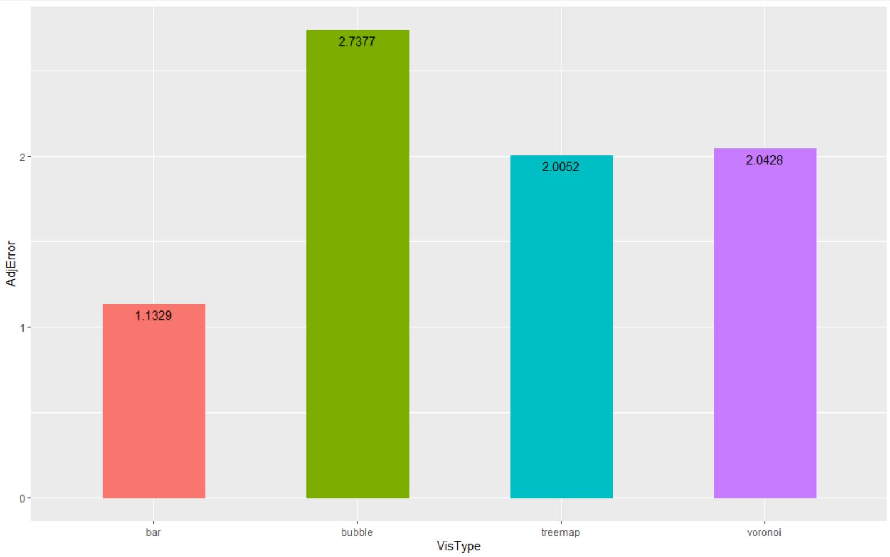

Assignment 3 - Replicating a Classic Experiment  
===

Link to Experiment
---
https://jacklafond.github.io/a3-Experiment/index.html

Intro
---
For this project I wanted to test the effectiveness of different types of area encoded visualizations. Specifically I compared regular treemaps, voronoi treemaps, and bubble charts, and I also included a bar chart as a baseline measurement since aligned bar charts are considered one of the best encodings to display and compare numeric values. I hypothesized that the bar chart would be most easily read by participants. For the area charts I thought that the most normal/comparable shapes would perform better, so I thought that the regular treemap would perform 2nd best, followed by the bubble chart, then lastly the voronoi treemap. For each visualization I generated 6 random values from 1-100, and selected two for the participant to compare. I tested 10 participants, each of which ran through the 80 run trial in order to get 800 data points (200 per visual). After collecting the data I used python to compile the results, calculate the error, and calculate the adjusted error. I then used R and gg plot to calculate and plot the average adjusted error for each visualization, as well as the bootstrapped 95% confidence intervals.

Charts
---

### Bar Chart

This is an example of one of the randomized bar charts in the experiment. The bar chart averaged an adj error of 1.1329, outperforming all other visualizations as expected. 

### Regular Treemap

This is an example of one of the randomized treemaps in the experiment. The regular treemap performed the second best with an average adj error of 2.0052.

### Voronoi Treemap

This is an example of one of the randomized voronoi treemaps in the experiment. The voronoi treemap performed similarly to the regular treemap with an average adj error of 2.0428. This came as a surprise to me.

### Bubble Chart

This is an example of the of the randomized bubble charts in the experiment. The bubble chart performed the worst out of the visualizations and averaged an adj error of 2.7377.

Overall Results
---

### Summary Bar Chart

This bar chart provides the overall summary of average adj errors for the visualizations tested. I was surprised to see that the voronoi treemap did almost as well as the regular treemap while the bubble chart performed worse. I did expect the regular tree map to perform the best of the three area charts as I thought the regularity and neatness of rectangles would be easier for participants to compare, than the polygons and circles in the other charts. 

### Bootstrapped 95% CI

This chart shows the ggplot calculations for the bootstrapped 95% confidence intervals for the performance of each visualization. From this chart we can see that the bar chart did significantly better than all other charts as expected. We can also see that the difference between the bubble chart and the treemap charts is significant. Lastly, there is not sufficient evidence to determine if there is a significant difference between the performance of the regular and voronoi treemaps. 

Design Achievements
---
- I attempted to create a clean and easily navigable website for the experiment
- I inlcuded and about and information section on the home page in order to inform participants
- I also used the same svg size across all charts to keep the layout consistent
- I used consistent design themes throughout each visualization, always using the same sized dots to indicate the selected values, and I used the same stroke thickness for each visual

Technical Achievements
---
- I implemented some higher level visualization types like the bubble chart that utilizes d3's pack method, as well as the voronoi tree map
- I made use of event listeners to make sure that no empty values where accidentally inputted (disable the enter button and function when input box is empty)
- I also used event listeners to allow the enter key to be another way of inputting rather than requiring a button click everytime
- Outputted the resulting csv of a trial to the browser so that a participant can save the file rather than copy and pasting text

